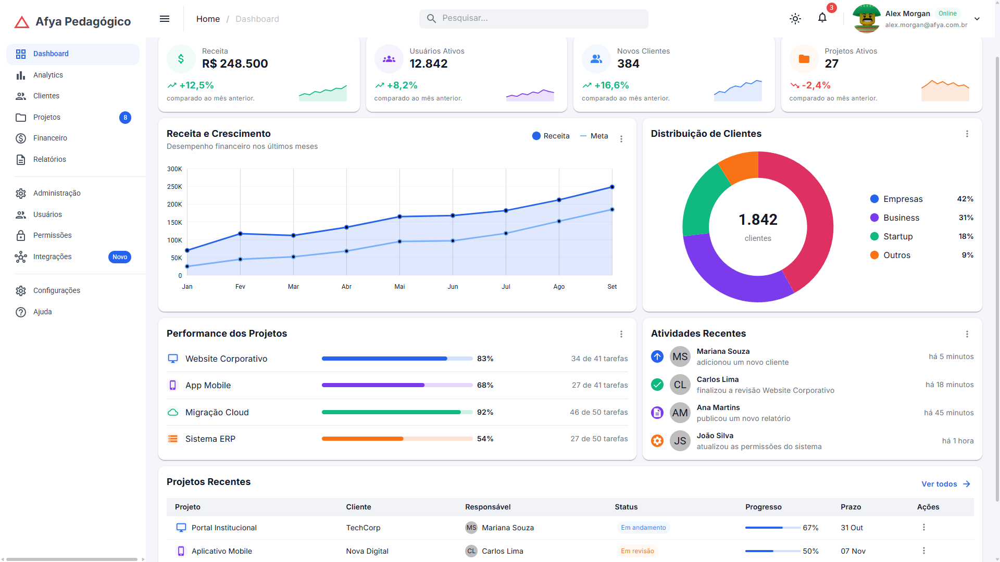
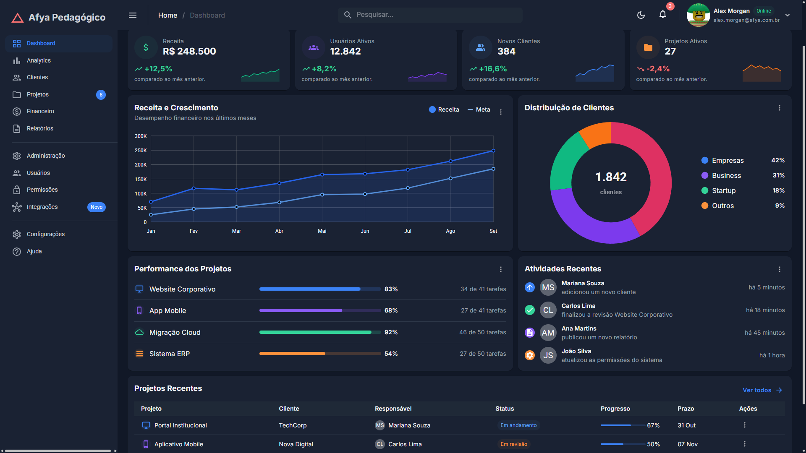
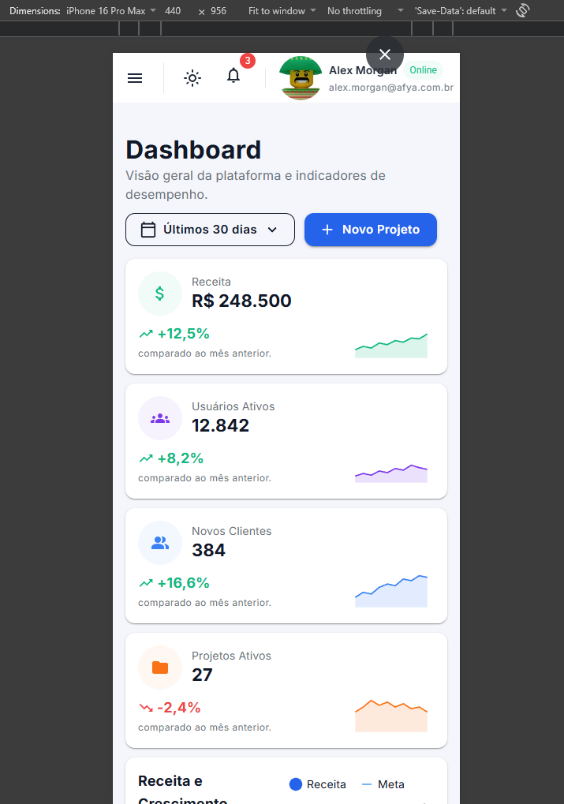
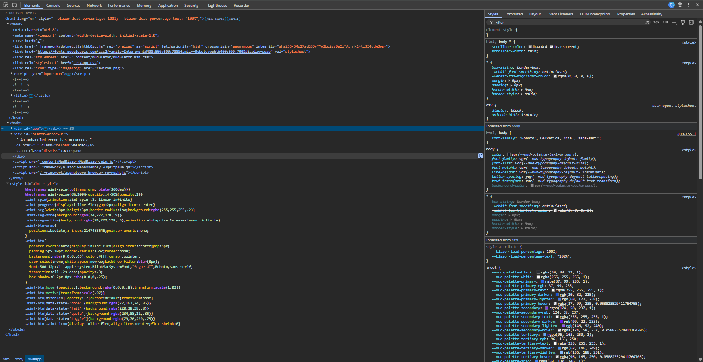

# afya-admin
# Afya Admin — Dashboard com Blazor WebAssembly e MudBlazor

## Identificação

| | |
|---|---|
| **Aluno(a)** | Alexandre Bruno de Sousa Sutil |
| **Matrícula** | 000000 |
| **Faculdade** | Afya São Lucas |
| **Curso** | Programação para Sistemas WEB |
| **Disciplina** | Ciência da Computação |
| **Professor(a)** | Liluyoud Cury Lacerda |
| **Semestre** | 2026.2 |

## Objetivo do projeto

Explique com suas palavras o objetivo do projeto e o que a página faz (2 a 4 parágrafos).

## Tecnologias utilizadas

- .NET 10 / Blazor WebAssembly
- MudBlazor 9

## Como executar

Passo a passo para outra pessoa clonar e rodar o projeto:

```bash
git clone https://github.com/Xandy66/afya-admin.git
cd afya-admin
dotnet watch
```

Informe também a versão do .NET SDK necessária.

## Telas

### Tema claro


### Tema escuro


### Versão mobile


### HTML gerado (DevTools)


Explique em poucas linhas o que o print do DevTools mostra: qual componente você inspecionou, qual HTML ele gerou e quais classes apareceram.

## Estrutura do projeto

Mostre a árvore de pastas e arquivos e explique em uma linha o papel de cada pasta (`Components`, `Data`, `Layout`, `Pages`, `wwwroot`).

## Componentes criados

| Componente | Responsabilidade | Parâmetros que recebe |
|---|---|---|
| `DashboardCard` | ... | ... |
| `KpiCard` | ... | ... |
| (liste todos) | | |

## O que aprendi

Responda **com suas próprias palavras** (um parágrafo curto por pergunta):

1. Como uma aplicação Blazor WebAssembly inicia no navegador? Qual é o papel do `index.html`, da `<div id="app">` e do `Program.cs`?
A inicialização do Blazor WebAssembly ocorre quando o navegador baixa e executa o motor do .NET via WebAssembly. O arquivo index.html serve como a casca HTML inicial da página, contendo a `<div id="app">`, que funciona como o marcador de posição onde a aplicação Blazor será renderizada após o carregamento; já o arquivo Program.cs é o ponto de entrada do código C#, responsável por configurar os serviços da aplicação e indicar ao Blazor que ele deve injetar o componente principal justamente dentro daquela div com ID app.

2. Qual é a diferença entre um **Layout**, uma **Page** e um **Component** neste projeto? Dê um exemplo de cada.
A diferença entre eles está no escopo e na responsabilidade estrutural dentro da interface. Um Layout define a estrutura visual global e repetitiva do sistema (ex: MainLayout.razor, que contém o menu lateral e o topo); uma Page representa uma tela acessível por uma URL específica através da diretiva @page (ex: Dashboard.razor); e um Component é um bloco visual isolado e reutilizável que não possui rota própria, criado para executar uma função específica dentro de uma página (ex: DashboardCard.razor).

3. O que é um `RenderFragment` e como o `DashboardCard` usa esse recurso para ser reutilizado por vários cards?
O RenderFragment é um tipo de dado no Blazor que permite passar um bloco inteiro de código HTML ou outros componentes como parâmetro para dentro de outro componente. O DashboardCard utiliza esse recurso (geralmente através de uma propriedade chamada ChildContent) para atuar como uma moldura genérica, permitindo que qualquer conteúdo customizado — como textos, ícones do MudBlazor ou gráficos — seja inserido dinamicamente dentro dele por quem o estiver chamando.

4. Como funciona o `@bind-Valor` no `SeletorPeriodo`? Qual é o papel do `ValorChanged`?
O @bind-Valor funciona como uma via de mão dupla (two-way data binding) que sincroniza automaticamente o estado do componente pai com o componente filho. Quando o valor selecionado muda internamente dentro do SeletorPeriodo, o Blazor dispara um evento obrigatório nomeado como ValorChanged (do tipo EventCallback), que avisa o componente pai sobre a modificação, atualizando a variável correspondente no pai de forma imediata e automática

5. Por que os dados ficam na pasta `Data`, separados dos componentes? Que vantagem isso traz se, no futuro, os dados vierem de uma API?
A separação dos dados na pasta Data isola a lógica de negócios e as regras de busca de informação da camada visual, seguindo o princípio de responsabilidade única. Se no futuro os dados passarem a vir de uma API, os componentes visuais não precisarão sofrer alterações estruturais ou estéticas; bastará modificar as classes de repositório ou serviços dentro da pasta Data para realizarem requisições HTTP, mantendo o restante do sistema intacto

6. Como o `MudGrid` com `xs`, `sm` e `lg` faz os cards de KPI se reorganizarem em telas de tamanhos diferentes?
O MudGrid organiza os cards de KPI utilizando um sistema de colunas responsivo baseado em um total de 12 espaços disponíveis na tela. As propriedades xs (telas muito pequenas), sm (telas médias/tablets) e lg (telas grandes/monitores) determinam quantas dessas 12 colunas cada card vai ocupar; por exemplo, definir xs="12" faz o card ocupar a largura inteira no celular (empilhando os cards), enquanto lg="3" permite exibir até quatro cards lado a lado em telas de computador

7. Como foi possível estilizar a página inteira sem escrever CSS? Explique o papel do tema (`MudTheme`) e das classes utilitárias.
A estilização sem CSS manual foi possível graças ao ecossistema do MudBlazor, que gerencia o design de forma programática. O MudTheme centraliza as configurações globais de identidade visual (como a paleta de cores primárias, secundárias e tipografia da marca), enquanto as classes utilitárias do MudBlazor aplicam espaçamentos, alinhamentos e comportamentos visuais diretamente nas tags HTML via atributos, eliminando a necessidade de criar arquivos .css customizados.

8. Por que o namespace do projeto é `afya_admin` e não `afya-admin`?
O namespace utiliza afya_admin com underline porque o caractere hífen (-) é um operador de subtração na linguagem C# e em várias outras linguagens de programação, sendo inválido para a nomeação de identificadores de código. Para garantir que o compilador do .NET consiga ler o nome do projeto e organizar suas classes corretamente sem gerar erros de sintaxe, o hífen é automaticamente substituído por um caractere válido, como o sublinhado.

## Dificuldades e soluções

Descreva pelo menos **dois problemas** que você enfrentou durante o desenvolvimento e como resolveu cada um.

## Melhorias futuras (opcional)

O que você implementaria a seguir? Se fez algum dos desafios da seção 20 do tutorial, descreva aqui.
